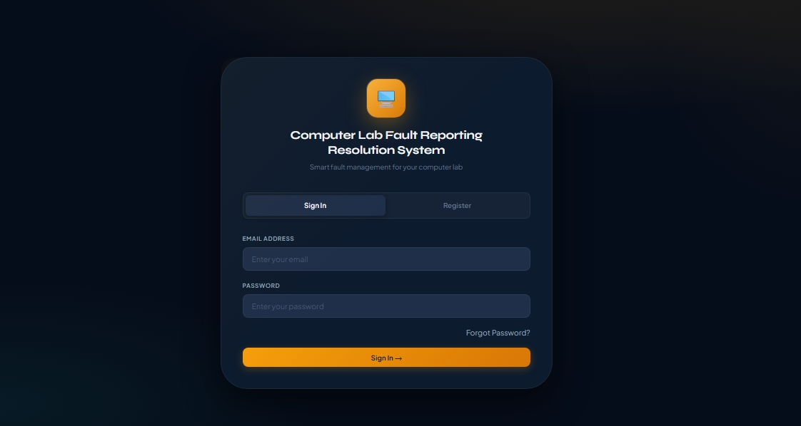
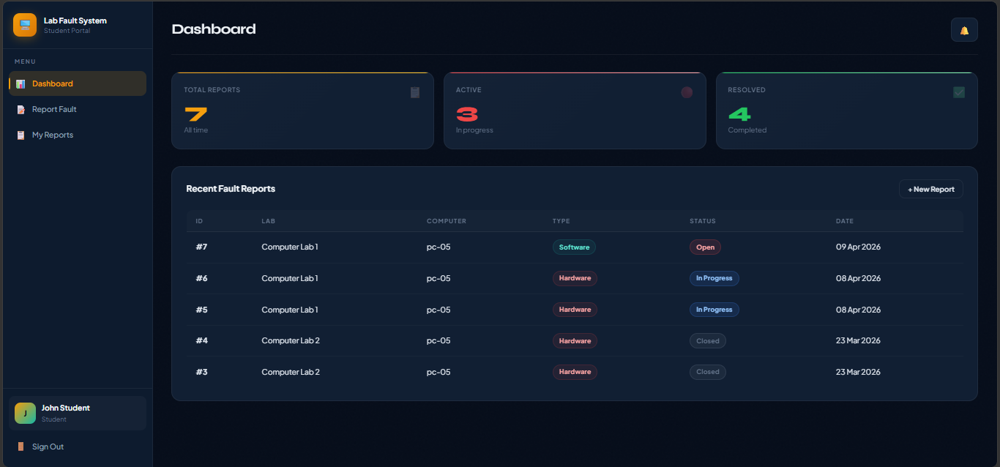
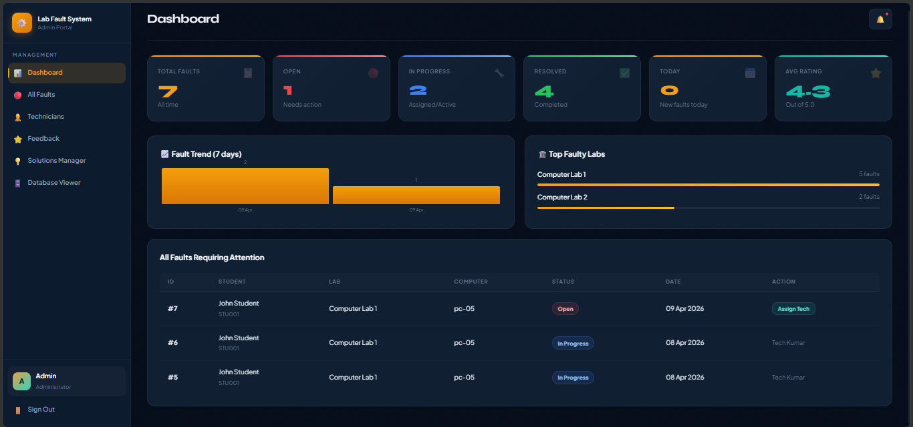
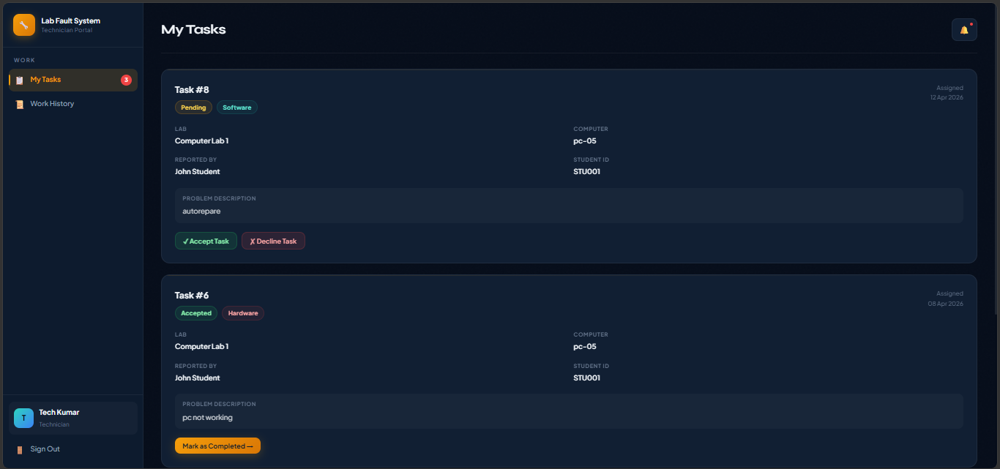

<div align="center">

# 🖥️ LabDesk
### Smart Lab Fault Management System

[](https://nodejs.org)
[](https://expressjs.com)
[](https://mysql.com)
[](https://render.com)

A full-stack web application for managing computer lab faults — from report submission to technician assignment, resolution tracking, and feedback collection.

[Live Demo](https://labdesk-93hf.onrender.com) · [Report Bug](https://github.com/ug8yogesh/LabDesk/issues) · [Request Feature](https://github.com/ug8yogesh/LabDesk/issues)

</div>

---

## 📖 Overview

LabDesk is a web-based platform designed to simplify computer laboratory maintenance and fault management. Students can report hardware and software issues, technicians can manage assigned tasks, and administrators can monitor, assign, and analyze fault reports through a centralized dashboard.

The system improves communication between students, technicians, and administrators while reducing downtime in computer laboratories.

---

## 📸 Screenshots

### Login Page


### Student Dashboard


### Admin Dashboard


### Technician Dashboard


---

## ✨ Features

### 👨‍🎓 Student
- Submit fault reports (hardware or software)
- Track real-time status of submitted faults
- Search the **self-help solutions library** before raising a ticket
- Mark a fault as self-resolved
- Receive **in-app notifications** on fault updates
- Rate resolved faults with **star feedback**

### 🔧 Technician
- View assigned tasks dashboard
- Accept, decline, or complete assigned tasks
- Add problem and solution notes per ticket

### 🛡️ Admin
- Full fault management with **search & filter** (status, type, keyword)
- **Assign faults** to technicians with workload visibility
- **Analytics dashboard** — 7-day fault trend chart + top faulty labs
- **Technician performance cards** with completion rate %
- **Feedback analytics** — star rating distribution
- **CSV export** of all fault reports
- Notify students directly from the panel
- Manage the software solutions library (add/edit/delete)

### ⚙️ System
- Secure session-based authentication (role-based: Admin / Technician / Student)
- Login brute-force protection (15-min block after failed attempts)
- Password reset via email (token-based)
- Mobile responsive UI with hamburger menu
- Toast notifications (no alert() dialogs)

---

## 🛠️ Tech Stack

| Layer | Technology |
|-------|-----------|
| Backend | Node.js, Express.js |
| Frontend | HTML5, CSS3, Vanilla JavaScript |
| Database | MySQL 8.0 |
| Auth | express-session, bcryptjs |
| Email | Nodemailer (Gmail) |
| Deployment | Render (backend), Railway (MySQL) |

---

## 🗄️ Database Schema

```
users                → id, name, email, password, role, student_id,
                        reset_token, reset_token_expiry
fault_reports        → id, student_id, lab_name, computer_number, fault_type,
                        description, status, assigned_technician_id,
                        resolution_notes, resolved_by_student,
                        created_at, updated_at
technician_tasks     → id, fault_id, technician_id, assigned_by, status,
                        problem_description, solution_description,
                        assigned_at, updated_at
software_solutions   → id, category, problem, solution, steps
notifications        → id, user_id, message, type, is_read, created_at
feedback             → id, fault_id, student_id, rating, comment, created_at
```

---

## 🚀 Local Setup

### Prerequisites
- Node.js 18+
- MySQL 8.0
- Gmail account (for email notifications)

### 1. Clone the repo
```bash
git clone https://github.com/ug8yogesh/LabDesk.git
cd LabDesk
```

### 2. Install dependencies
```bash
npm install
```

### 3. Set up the database
Open MySQL and run:
```bash
mysql -u root -p < databasesetup.sql
```

### 4. Configure environment
```bash
cp .env.example .env
```
Edit `.env`:
```env
DB_HOST=localhost
DB_USER=root
DB_PASSWORD=your_mysql_password
DB_NAME=lab_fault_system

PORT=3000
NODE_ENV=development
SESSION_SECRET=your_long_random_secret_here

EMAIL_USER=your_email@gmail.com
EMAIL_PASS=your_gmail_app_password
```

> **Gmail App Password:** Google Account → Security → 2-Step Verification → App Passwords → Generate

### 5. Start the server
```bash
npm start
```
Open [http://localhost:3000](http://localhost:3000)

---

## 🌐 Deployment (Render + Railway)

### Step 1 — MySQL on Railway
1. [railway.app](https://railway.app) → New Project → **MySQL**
2. Go to **Query** tab → paste and run `databasesetup.sql`
3. Copy connection credentials from **Variables** tab

### Step 2 — Backend on Render
1. [render.com](https://render.com) → New → **Web Service**
2. Connect GitHub repo
3. Set:
   - **Build Command:** `npm install`
   - **Start Command:** `node server.js`
4. Add environment variables (DB credentials from Railway + session secret + Gmail)
5. Deploy ✅

---

## 🔑 Demo Accounts

| Role | Email | Password |
|------|-------|----------|
| Admin | admin@lab.com | admin123 |
| Student | student@lab.com | student123 |
| Technician | tech@lab.com | tech123 |

> ⚠️ These are default seed accounts created automatically for testing and demonstration purposes.

---

## 📡 API Reference

| Method | Endpoint | Role | Description |
|--------|----------|------|-------------|
| POST | `/api/auth/login` | All | Login |
| POST | `/api/auth/register` | All | Register |
| POST | `/api/auth/logout` | All | Logout |
| GET | `/api/auth/me` | All | Get current session user |
| POST | `/api/auth/forgot-password` | All | Send reset email |
| POST | `/api/auth/reset-password` | All | Reset password via token |
| GET | `/api/solutions` | All | Self-help library |
| POST | `/api/faults` | Student | Submit fault report |
| GET | `/api/faults/my` | Student | View my reports |
| PATCH | `/api/faults/:id/self-resolved` | Student | Mark fault as self-resolved |
| POST | `/api/feedback` | Student | Submit feedback |
| GET | `/api/technician/tasks` | Technician | View assigned tasks |
| PATCH | `/api/technician/tasks/:id` | Technician | Update task status/notes |
| GET | `/api/admin/faults` | Admin | All fault reports |
| GET | `/api/admin/technicians` | Admin | Technician workload list |
| POST | `/api/admin/assign` | Admin | Assign fault to technician |
| POST | `/api/admin/notify-student` | Admin | Notify student of resolution |
| GET | `/api/admin/feedback` | Admin | All feedback entries |
| GET | `/api/admin/stats` | Admin | Dashboard analytics |
| GET | `/api/admin/export/faults` | Admin | Download CSV |
| GET | `/api/admin/db/:table` | Admin | Raw table viewer |
| GET/POST/PUT/DELETE | `/api/admin/solutions` | Admin | Manage solutions library |
| GET | `/api/notifications` | All | View notifications |
| PATCH | `/api/notifications/read` | All | Mark notifications as read |

---

## 📁 Project Structure

```
LabDesk/
├── server.js              # Express app + all API routes
├── databasesetup.sql      # Full DB schema + seed data
├── package.json
├── .env.example
└── public/
    ├── index.html         # Redirect to frontend
    └── frontend/
        ├── index.html     # Main SPA
        ├── reset-password.html
        ├── css/
        │   └── style.css
        └── js/
            └── main.js    # All frontend logic
```

---

## 🔒 Security

- Passwords hashed with **bcryptjs**
- Brute-force login protection (15-min block)
- Session cookie: `httpOnly`, `sameSite: strict`, HTTPS-only in production
- Request body size limited (50KB)
- Role-based route protection on all API endpoints
- Environment variables for all secrets — no hardcoded credentials

---

## 🌍 Live Application

🔗 https://labdesk-93hf.onrender.com

---

## 📄 License

MIT License — free to use and modify.

---

## 👨‍💻 Author

**Yogesh U G**

- 🎓 IT-Anna University Student
- 🐙 GitHub: https://github.com/ug8yogesh

---

<div align="center">
  🌟 If you found this project useful, consider giving it a star on GitHub!
</div>